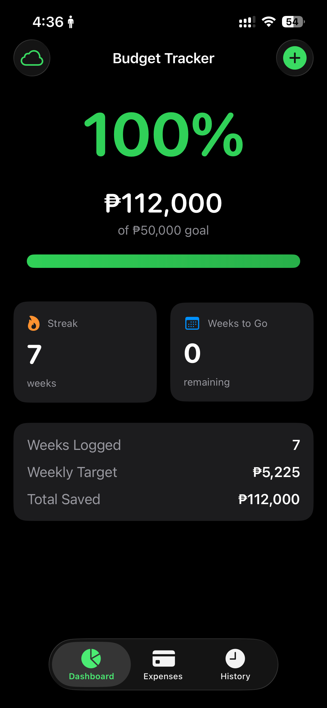
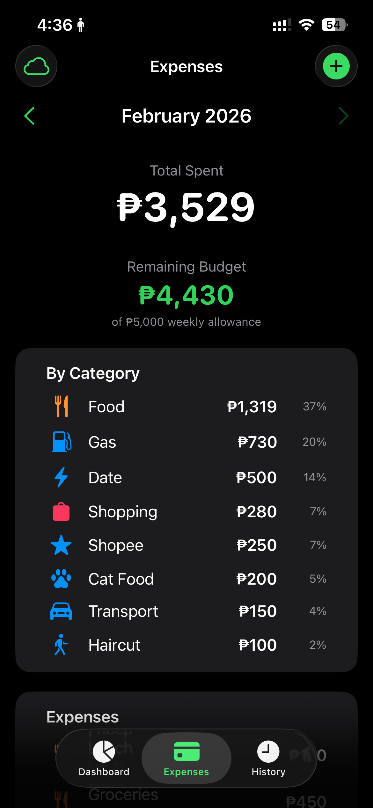
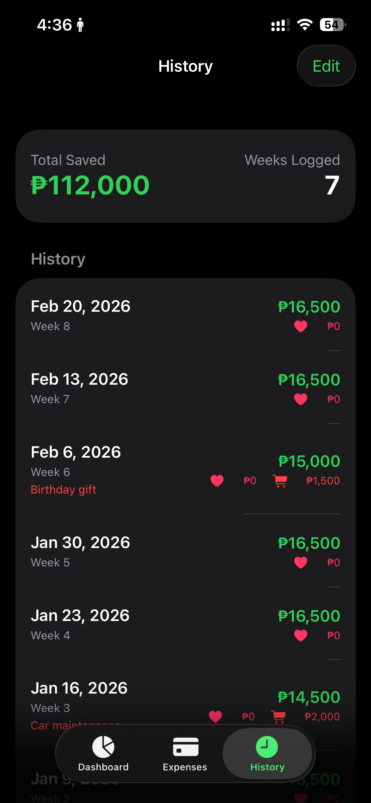

# Budget Tracker

My personal budget tracker iOS app. I built this to help me build savings and actually track what I'm spending so I don't end up broke when AI takes over my job lol.

## Screenshots

  
  
  

## What it does

- Log weekly income, bills, allowance, and savings
- Track expenses by category (food, gas, shopping, custom ones too)
- Dashboard with savings progress, streak, and weeks remaining
- Cloud sync to a self-hosted server so I don't lose my data
- iOS widgets for home screen and lock screen

## Tech

- SwiftUI + SwiftData
- WidgetKit
- FastAPI backend for sync
- Sideloaded via Xcode

## Setup

1. Clone the repo
2. Open in Xcode
3. Replace the server URL and API key in `SyncService.swift` and `BudgetWidget.swift` with your own, or just remove the sync — everything works offline with SwiftData
4. Build and run
